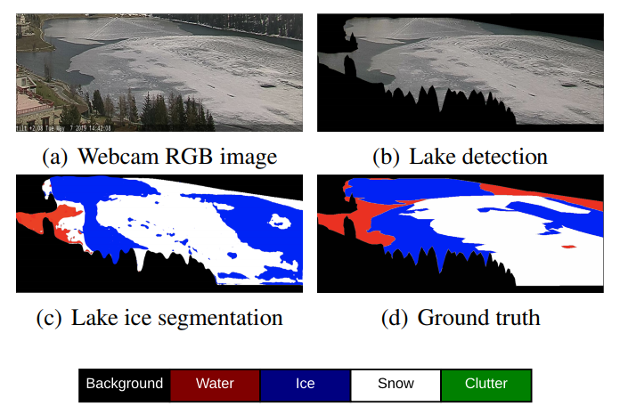

# Lake Ice Monitoring with Webcams and Crowd-Sourced Images

This repository is the implementation (Tensorflow) our paper:
Prabha R., Tom M., Rothermel M., Baltsavias E., Leal-​Taixe L., Schindler K.: [Lake Ice Monitoring with Webcams and Crowd-​Sourced Images](https://arxiv.org/pdf/2002.07875.pdf), ISPRS Congress, Nice, France, 2020 (accepted for publication)



This work is part of the [Lake Ice Project (Phase 2)](https://prs.igp.ethz.ch/research/current_projects/integrated-lake-ice-monitoring-and-generation-of-sustainable--re.html). Here is the link to [Phase 1](https://prs.igp.ethz.ch/research/completed_projects/integrated-monitoring-of-ice-in-selected-swiss-lakes.html) of the same project. 

## What this repo contains?
1. Deeplab v3+ tensorflow model adopted from official tensorflow repository with some changes.
  (a). Code for calculating Individual class IoU. 
  (b). Code for checking confusion matrix on tensorboard.
  (c). Updated xception_65 model with extra skips from encoder to decoder.
2. Using labelme tool to create data annotations and code for converting json annotations to color-indexed masks.
3. Some data cleaning scripts (only valid for our Photi-LakeIce dataset).
4. Jupyter Notebook for visualizing data distribution for 5 classes : background, water, ice, snow, clutter.
5. Jupyter Notebook for inference using a saved tensorflow checkpoint.

## Steps to reproduce the experiment.

Data
Folder structure:
  ```bash
├── datasets
    ├── lake
        ├── JPEGImages
        ├── SegmentationClassPNG
        ├── SegmentationClassRaw
        ├── Imagesets
            ├── train.txt
            ├── val.txt
        ├── abc.tfrecord

```
1. Place the Images in JPEGImages and segmentation color masks in SegmentationClassPNG. Run remove_gt_colormap_lakeice.py to covert the RGB color codes to class number, i.e. 0 for Background, 1 for Water, 2 for Ice, and so on. Take care of paths label_dir (SegmentationClassPNG directory) and new_label_dir (SegmentationClassRaw directory).
2. Create a folder Imagesets which contains the train.txt (training image sample names) and val.txt (testing image sample names) files. Refer sampletrain.txt in datasets folder to see how the txt files look.
3. Update data_generator.py file. Specifically, update the numbers for train samples and val samples in _LAKEICE_INFORMATION.
3. Now, Convert data into tensorflow record by running bash script download_and_convert_lakeice.sh (Take care of the directory paths in the script).

Voila, now you have the dataset to train your model.


By simply running the train_lakeice.sh, the training will start.
For parameters: the specified values were used for all experiments.
1. Setup up the tensorflow records in LAKEICE_DATASET parameter.
2. --model_variant="xception_65" -> Change to "xception_65_skips" to use Deep-U-Lab 
   --skips=0                     -> Change to 1, if using "xception_65_skips" 
   --atrous_rates=6 
   --atrous_rates=12 
   --atrous_rates=18 
   --output_stride=16 
   --decoder_output_stride=4 
   --train_crop_size="321,321"   -> Used 512,512 for lake-detection and 321,321 for lake-ice segmentation 
   --dataset="lake" 
   --train_batch_size=8          -> Set according to GPU availability. This should be >=16 for tuning the batch norm layers 
   --training_number_of_steps="${NUM_ITERATIONS}"
   --fine_tune_batch_norm=false  -> Set to "true" if train_batch_size>=16 
   --train_logdir="${TRAIN_LOGDIR}" 
   --base_learning_rate=0.0001 
   --learning_policy="poly" 
   --tf_initial_checkpoint="/your_checkpoint_folder_name/model.ckpt" (You may update this!) 
   --dataset_dir="${LAKEICE_DATASET}" 
   

For evaluation and visualization, run the eval_lakeice.sh script.
  
   --eval_split="val"             -> Split should be "val", instead of "train" 
   --model_variant="xception_65"  -> Same rules as train script
   --skips=0 
   --eval_crop_size="325,1210"    -> Full image eval_crop_size 
   --max_number_of_evaluations=1  -> If set to 1, evaluation script will run once and exit. If >1, it will keep checking the train logdir for new checkpoints. Useful, when running both train and eval scripts simultaneously (alloting part of GPU to both). 

## Pre-trained model
[Download](https://share.phys.ethz.ch/~pf/tommdata/Pre-trained_Model.tar.xz) the model pre-trained on Lake St. Moritz data (Cam0, winter 2016-17) from the [Photi-LakeIce dataset](https://github.com/czarmanu/photi-lakeice-dataset)

## Beware of some common bugs.
1. for no modules called nets.
   Get the 'slim' directory from https://github.com/tensorflow/models/tree/master/research and from the research folder, run 
   ```python
   export PYTHONPATH=$PYTHONPATH:`pwd`:`pwd`/slim
   ```
2. Iterator end of line error.
   Look for empty lines in the dataset/"your dataset"/List/"train or val".txt files.
  
3. Dataset split  in train.py and eval.py, be careful to not use the default "trainval" split from original tensorflow deeplab    repository.

## Citation
Please cite our paper, if you use this repo:

@inproceedings{prabha_tom_2020:isprs,
author={Prabha, R. and Tom, M. and Rothermel, M. and Baltsavias, E. and Leal-Taixe, L. and Schindler, K.},
booktitle={arXiv preprint: arXiv:2002.07875v2},
title={Lake Ice Monitoring with Webcams and Crowd-Sourced Images},
year={2020},
}


## References
1. Chen Liang-Chieh et. al 2018, Encoder-Decoder with Atrous Separable Convolution for Semantic Image Segmentation, ECCV. https://github.com/tensorflow/models/tree/master/research/deeplab
    
2. Wad Ketaro 2016, labelme: Image Polygonal Annotation with Python. https://github.com/wkentaro/labelme

3. Photi-Lake Ice Dataset ([Github repo](https://github.com/czarmanu/photi-lakeice-dataset))
